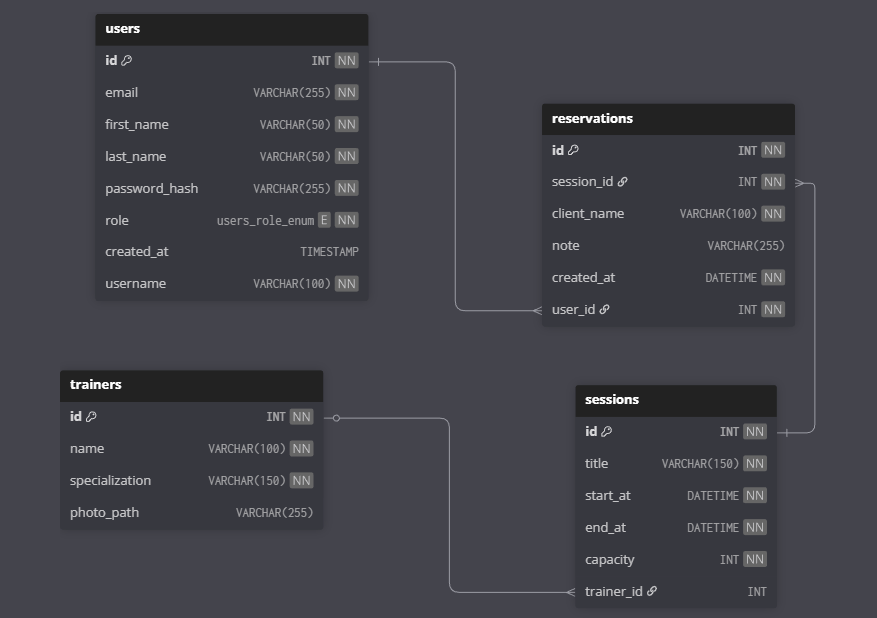

# Rezervačný portál posilňovne
Aplikácia Gym Rezervácie je webový portál na správu posilňovne, trénerov, tréningov a rezervácií. Umožňuje registráciu, prihlasovanie, rezervovanie tréningov a správu používateľov podľa rolí (admin, tréner, zákazník). Postavená je na Node.js, Express, EJS a MySQL.
## Návod na inštaláciu a spustenie

### Požiadavky

- Node.js (odporúčané LTS)
- MySQL Server (odporúčané MySQL 8.x) + ideálne MySQL Workbench

### 1) Inštalácia závislostí

V koreňovom priečinku projektu nainštaluj balíčky cez `npm install`.

### 2) Databáza (import schémy)

Schéma je v `MySQL/schema.sql`.

Dôležité: v tomto projekte `schema.sql` **obsahuje** aj:

- `CREATE SCHEMA IF NOT EXISTS gym_rezervacie`
- `USE gym_rezervacie`

To znamená, že script je pripravený pre databázu s názvom `gym_rezervacie`.

Možnosti:

1) **Použiješ názov `gym_rezervacie` (odporúčané)**
   - importuj `MySQL/schema.sql` (Workbench alebo CLI)
   - v `.env` nastav `DB_NAME=gym_rezervacie`

2) **Chceš iný názov databázy**
   - uprav v `MySQL/schema.sql` názov v `CREATE SCHEMA ...` a `USE ...`
   - a rovnako uprav `DB_NAME` v `.env`

### 3) Konfigurácia `.env`

V koreňovom priečinku projektu nastav premenné prostredia v súbore `.env`.

Odporúčaný postup:

- skopíruj `.env.example` → `.env`
- uprav hodnoty podľa svojho MySQL

Povinné pre spustenie:

- `DB_HOST`, `DB_USER`, `DB_PASSWORD`, `DB_NAME`
- `SESSION_SECRET` (odporúčané 32+ náhodných znakov)

### 4) Seed (naplnenie testovacích dát)

Projekt obsahuje seed skript `src/seed.js` (spúšťa sa cez `npm run seed`).

Čo seed spraví:

- vytvorí/aktualizuje používateľov (`users`) – admin, trainer, user1, user2 (+ jeden pevný testovací účet v kóde)
- vytvorí/aktualizuje trénerov (`trainers`) so seed obrázkami z `public/images/*`
- vytvorí tréningy (`sessions`) s dátumami do budúcnosti (aby sa zobrazovali na domovskej stránke)
- vytvorí ukážkové rezervácie (`reservations`) pre user1/user2

Predvolené účty (seed skript používa tieto hodnoty ako default, ak ich v `.env` nenastavíš):

- **admin:** `admin@gym.local` / `admin123` (rola `admin`)
- **trainer:** `trainer@gym.local` / `trainer123` (rola `trainer`)
- **user1:** `user1@gym.local` / `userone123` (rola `user`)
- **user2:** `user2@gym.local` / `usertwo123` (rola `user`)

Ak chceš iné prihlasovacie údaje, uprav hodnoty v `.env` a seed spusti znova.

### 5) Spustenie aplikácie

- Dev režim (nodemon): `npm run dev`
- Produkčné spustenie: `npm start`

Server štartuje z `src/server.js` a beží defaultne na `http://localhost:3000`.

## Databázový model

Diagram je v `MySQL/databaza.png` a je konzistentný so schémou v `MySQL/schema.sql` (tabuľky `users`, `trainers`, `sessions`, `reservations` + ich väzby).

- tabuľky: `users`, `trainers`, `sessions`, `reservations`
- väzby:
  - `sessions.trainer_id -> trainers.id` (ON DELETE SET NULL)
  - `reservations.session_id -> sessions.id` (ON DELETE CASCADE)
  - `reservations.user_id -> users.id` (ON DELETE CASCADE)

## Dokumentácia

### Tech stack

- Backend: Node.js, Express (`src/app.js`, `src/server.js`)
- View layer: EJS (`views/*.ejs`)
- Databáza: MySQL cez `mysql2` pool (`src/config/database.js`)
- Sessions: `express-session` (`src/config/session.js`)

### Architektúra (MVC tok)

`routes` → `controllers` → `models` → MySQL

- routy: `src/routes/*Routes.js`
- controllery: `src/controllers/*Controller.js`
- modely: `src/models/*Model.js`

### Autentifikácia a roly

- Prihlásenie: `GET/POST /login` (`src/controllers/authController.js`)
- Registrácia: `GET/POST /register` (vytvára používateľa s rolou `user`)
- Odhlásenie: `POST /logout`

Roly:

- `admin`: správa používateľov + tréneri + tréningy + vidí všetky rezervácie
- `trainer`: tréningy + vidí všetky rezervácie
- `user`: vytvára rezervácie, vidí iba svoje

Vynucovanie rolí je cez middleware `requireRole(...)` a `requireCustomer` (`src/middlewares/auth.js`).

### Funkcie aplikácie (čo kde nájdeš)

- Tréneri (CRUD, admin-only):
  - `GET /treneri`
  - `GET/POST /treneri/new`
  - `GET/POST /treneri/:id/edit`
  - `POST /treneri/:id/delete`
  - upload fotky cez multer: `src/middlewares/trainer-upload.js` (max 3MB, jpeg/png/webp)

- Tréningy / sessions (CRUD, admin+trainer):
  - `GET /treningy` (+ filter podľa trénera)
  - `GET/POST /treningy/new`
  - `GET/POST /treningy/:id/edit`
  - `POST /treningy/:id/delete`

- Rezervácie:
  - `GET /rezervacie` (user: svoje, staff: všetky)
  - `GET/POST /rezervacie/new?treningId=...` (iba rola `user`)
  - `POST /rezervacie/:id/delete`
  - ochrany: duplicitná rezervácia + kontrola kapacity (v `src/controllers/reservationsController.js`)

- Správa používateľov (admin-only):
  - `GET /uzivatelia`
  - `POST /uzivatelia/:id/role`

### AJAX funkcionality

Klientsky JS je v `public/js/ajax.js`:

- zmazanie rezervácie bez reloadu: `POST /api/rezervacie/:id/delete`
- zmena roly používateľa bez reloadu: `POST /api/uzivatelia/:id/role`

### Bezpečnosť

- CSRF ochrana: `csurf` (globálne v `src/app.js`), token v `res.locals` cez `src/middlewares/view-locals.js`
- Rate limiting pre login: `src/middlewares/rate-limiters.js`
- Helmet headers: `helmet` v `src/app.js` (CSP vypnuté kvôli CDN)
- Session cookie: `httpOnly`, `sameSite=lax`, `secure` v produkcii (`src/config/session.js`)

### Údržba (cleanup)

`src/services/cleanupService.js` pravidelne maže skončené tréningy (sessions s `end_at < NOW()`), pričom rezervácie sa zmažú automaticky cez FK `ON DELETE CASCADE`.

## Troubleshooting

- Chyba „Chýba DB_NAME v .env“: doplň `DB_NAME` do `.env` a uisti sa, že databáza existuje.
- Chyba „ER_NO_SUCH_TABLE“ pri seedovaní: najprv importuj `MySQL/schema.sql` do DB.
- Upload fotky neprejde: typ musí byť `jpeg/png/webp` a veľkosť max 3MB.

